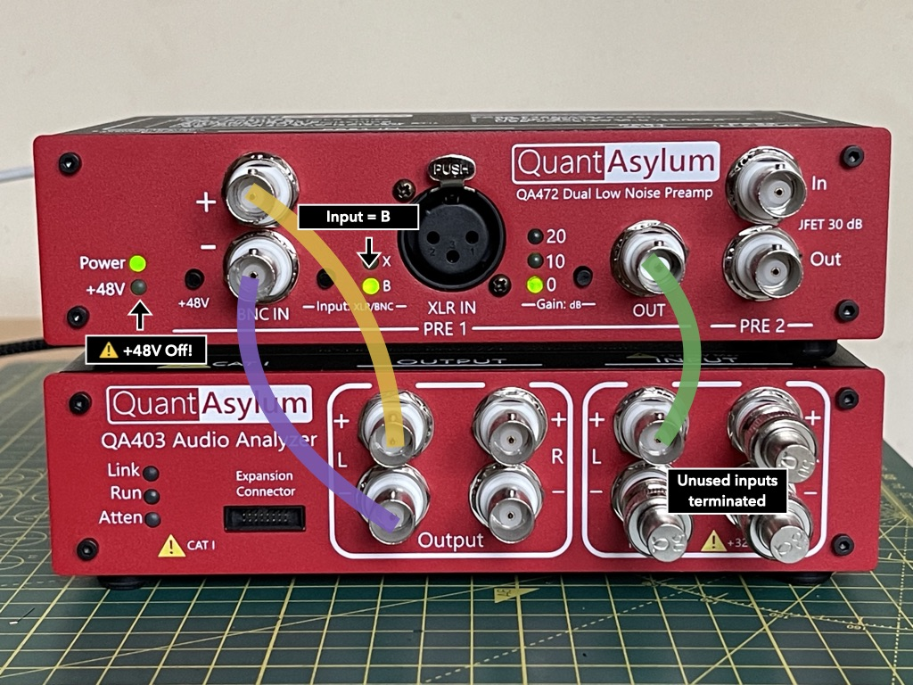
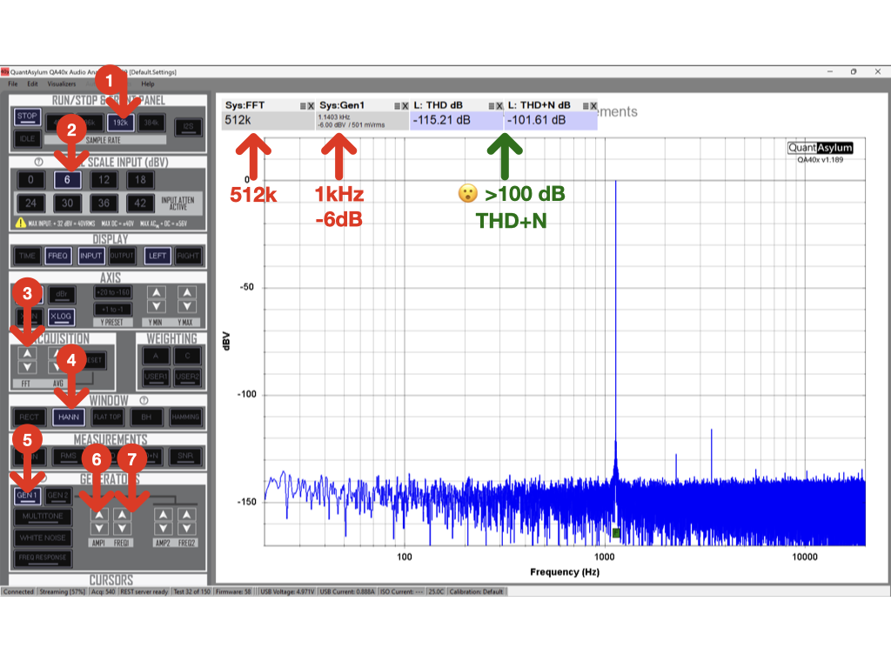

# Measure the QA472 noise floor using the QA403

In this guide, we will measure the ultra-low-noise performance of the QA472 using the QA403 Audio Analyzer.

## Power-up the devices

Power-up both devices by connecting them to your computer or USB hub. Verify that the power light is illuminated on both the QA472.

## Connections between preamp and analyzer

!!! danger
    Before making any connections, make sure that the +48V is turned off. This is above the ±40V DC rating of the QA403. Activating phantom power could damage your audio analyzer.

We are going to use the balanced outputs of the QA403 to generate a signal for the QA472 to amplify. The amplified signal will be returned to the QA403 single-ended input for analysis.

1. +48V phantom power must be **off** before continuing.
2. Enable the BNC input to preamp 1 by toggling the input button until the "B" LED is illuminated.
3. Select 0 dB gain using the gain button.
4. Connect BNC connectors:
    * Analyzer Ouput L+ to Preamp 1 BNC+ Input
    * Analyzer Output L&ndash; to Preamp 1 BNC&ndash; Input
    * Analyzer Input L+ to Preamp 1 BNC OUT

5. Connected BNC shorting caps on unused audio anaylzer inputs.

## Using the QA40X software

You might want to experiment with different settings to see what works best for you. Here is a configuration I arrived at after a few minutes of playing around with different values to get the smallest THD + N value.

To replicate these settings, make sure the analyzer is not already running and follow these steps:

1. Select a 192k sample rate
2. Select a 6 dBV input scale
3. Increase the FFT size to 512k samples.
4. Pick a windowing function, in this case Hann.
5. Select generator Gen1
6. Change the amplitude of the signal to the largest value you can before distortion increases. For me, this was -6 dB.
7. Set the frequency of the measurement; usually 1kHz is the standard option.

If you do not see the THD and THD+N measurement boxes above the plot, then above the generators panel, find the "measurements" panel and toggle the THD buttons; the measurement boxes should appear.
