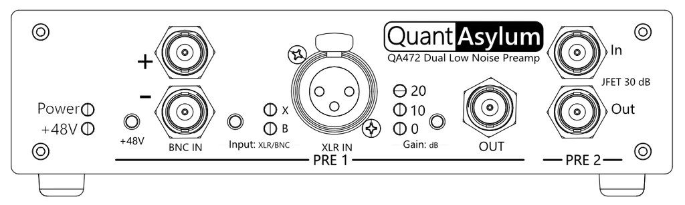

# QA472 Dual Low-Noise Preamp

The QA472 is a two-channel low-noise microphone preamp. As a reference amplifier, it can be used for accurate and repeatable measurements of sound pressure level when combined with a calibrated microphone. It is compact, easily powered, and can be used on a bench or in a portable testing setup.

Preamp 1 provides three selectable gain levels (0, 10, and 20 dB) to accommodate a variety of microphones, input levels, and the option for +48V phantom power.

Preamp 2 provides a fixed gain of 30 dB, a higher input impedance, and lower noise compared with Preamp 1.

Balanced or single-ended connections are made to the preamp using BNCs or the front panel XLR socket (Channel 1 only). Outputs are taken from BNC connectors, one for each channel.

Power is supplied by a USB-B socket on the back panel and draws approximately 100 mA at 5 volts. This is internally isolated for low-noise operation.

The QA472 is not designed as a microphone recording solution and does not appear as a USB device when connected to a computer &mdash; USB just provides power.

-   :material-clock-fast:{ .lg .middle } __Get started in 5 minutes__

    ---

    First steps with the QA472.

	[:octicons-arrow-right-24: Measurements using the QA403](https://forum.quantasylum.com/t/qa472-measurements/1006#measuring-pre1-ina849-01020-db-preamp-1)

-   :material-help-circle:{ .lg .middle } __Join the Forum__

    ---

    Get community support.

    [:octicons-arrow-right-24: Forum](https://forum.quantasylum.com/)

-   :material-check-outline:{ .lg .middle } __Read the docs__

    ---

    Quick summary of all device features.

    [:octicons-arrow-right-24: Documentation](overview/pre1.md)
	
-   :material-file-document-outline:{ .lg .middle } __Read the data sheet__

    ---

    Review device performance in more detail.

    [:octicons-arrow-right-24: Product Page](https://quantasylum.com/collections/frontpage/products/qa472-low-noise-mic-preamp)

