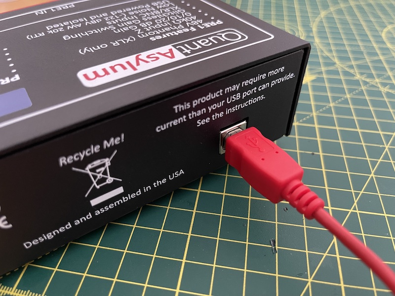
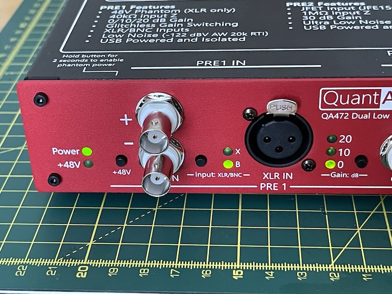

# USB Power

The QA472 receives power by connecting the USB-B port on the back panel to either a powered USB hub or your computer. The current draw is fairly low, around 100 mA. Note that the device is not USB-controlled; all control is done using the front-panel buttons with states that persist across power cycles.

## Boot

!!! note
    For best performance, allow 5 minutes for the temperature to stabilise before use.
    
On receiving power, the green power LED will illuminate, and other front panel LEDs will flash. The device is ready to use once the boot is complete and the flashing LEDs stop. However, it is recommended to wait 5 minutes or until the unit has fully reached room temperature before use.

## Isolation

!!! warning
    Do not exceed ±50V between USB (shield) and audio ground potentials (BNC shield).

There is no galvanic connection between the QA472 inputs and the USB power ground. This removes the possibility of ground loops and noise injection when connecting the QA472 to grounded external equipment. The isolation ensures a resistance of greater than 10 MOhms should appear between the BNC shields (audio common) and the USB ground at 1 kV test voltage.
