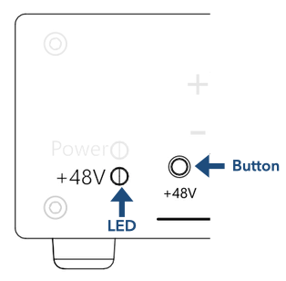
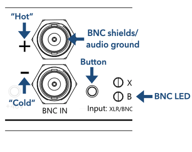
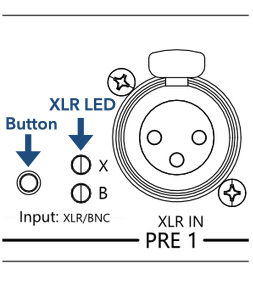
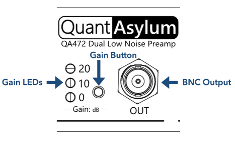

# Preamp 1 (Op-amp)

Preamp 1 is highlighted in the diagram above and includes BNC or XLR inputs; this is user-selectable via the switch labelled "Input: XLR/BNC" and an LED illuminates to indicate the currently selected input. Phantom power can be applied to the XLR pins by pressing and holding the +48V button for 2 seconds. Finally, the preamp gain can be selected from 0, 10, and 20 dB. The device provides a single-ended output BNC terminal.

The Preamp 1 is based on the [INA849](https://www.ti.com/product/INA849) an ultra-low-noise precision instrument (differential) amplifier. Different QA472 are freely interchangeable because the INA849's on-die resistors are laser trimmed to achieve precise gain values. Device-to-device variation should be on the order of ±0.05 dB, which is an order of magnitude improvement over the QA471.

From left to right, we will review the purpose of each front panel item. 

## Phantom Power

!!! note
    Phantom power is only supplied to the XLR socket. Press and hold for two seconds to enable power, and 46.75V ±1.25% will appear across the balanced outputs.

{: style="height:308px"}

+48V can be supplied to a condenser microphone connected to the XLR input. To enable phanthom power, press and hold the +48V button for 2 seconds. You will see the +48V LED illuminate, at which point you can release the button.

Similary, phanthom power can be disengaged by simply pressing the button again; it is not necessary to hold the press when turning phanthom power off.

Phantom power is only supplied to the XLR input. When toggling the input to the BNC channel a reduced voltage does appear across the BNC terminals for a short time until bleed resistors have drained the charge. This is unlikely to cause any problems with whatever is connected to the BNC terminals, however, out of caution you may prefer to use either the BNC or the XLR inputs at a time.

## BNC Input

!!! warning
    Inputs have minimum and maximum limits to the DC voltage (with respect to the BNC shield) of -1V and +50V and a maximum safe current limit of less than 20mA. Ensure that the voltages and currents drawn are within these limits. See the datasheet for more information.

{: style="height:308px"}

To enable the BNC input, press the BNC button until the LED labelled "B" illuminates.

### Balanced connection

Balanced sources are relative to audio ground, which is the shield of the BNC connector. The hot (+) and cold (&ndash;) pins of the balanced should be connected to the positive (+) and negative (&ndash;) labelled BNC inputs, respectively. The input impedance is high, around 110 kOhms.

### Single-ended connection

Preamp 1 is designed for balanced connections; however, single-ended connections are possible by shorting the negative BNC terminal using a 0 Ohm shorting block. The single-ended voltage is applied to the positive BNC terminal. In this configuration, the input impedance is 55 kOhms.

## XLR Input

!!! warning
    Inputs have minimum and maximum limits to the DC voltage (with respect to the BNC shield) of -1V and +50V and a maximum safe current limit of less than 20mA. Ensure that the voltages and currents drawn are within these limits. See the datasheet for more information.

{: style="height:308px"}

To enable the XLR input, press the Input Button until the LED labelled "X" illuminates.

### Balanced connection

Balanced sources are relative to audio ground, which is pin 1 of the XLR socket. The hot (+) and cold (&ndash;) pins of the balanced must be connected to pins 2 and 3, respectively. The input impedance is high, around 110 kOhms, and with Phantom Power enabled, this drops to 13.6 kOhms.

!!! info
    Balanced XLR convention: Pin 1 = common, Pin 2 = hot, and Pin 3 = cold.

### Single-ended connection

Preamp 1 is designed for balanced connections; however, single-ended XLR connections are possible by wiring the cable such that pin 3 is shorted by pin 1. In this configuration, the input impedance is 55 kOhms, and with Phantom Power enabled, this drops to 6.8 kOhms.

!!! info
    Single-ended XLR convention: Pin 1 = common, Pin 2 = hot, and Pin 3 = common.

## BNC Output and Gain

Three gain levels (0, 10, and 20 dB) are cycled through by toggling the gain button on the front panel. The single-ended amplified signal is returned via the BNC terminal. The output impedance is 100 Ohms.

{: style="height:308px"}

## Noise performance

The excellent noise performance of Preamp 1 is shown below for the three different gain settings; for more information, see the datasheet.

| Gain  |        RTO |        RTI |     RTI AW |
|-------|-----------:|-----------:|-----------:|
| 0 dB  | -102.5 dBV | -102.5 dBV | -104.5 dBV |
| 10 dB | -102.0 dBV | -112.0 dBV | -114.0 dBV |
| 20 dB | -100.5 dBV | -120.5 dBV | -122.5 dBV |

RTO and RTI are the noise levels referred-to-output and referred-to-input, respectively. The last column shows the A-weighted noise performance.

## Gain, accuracy, and precision

Gain values are very precise due to the tight tolerances of the [INA849](https://www.ti.com/product/INA849) instrument amplifier, only varying ± 0.05 dB. The accuracy of gain settings is better than 0.6% in all cases, as this depends on the variation and values of board-level components. For more information, see the datasheet.

| Gain  |         Nominal |
|-------|----------------:|
| 0 dB  |  0.00 ± 0.05 dB |
| 10 dB |  9.94 ± 0.05 dB |
| 20 dB | 20.01 ± 0.05 dB |

