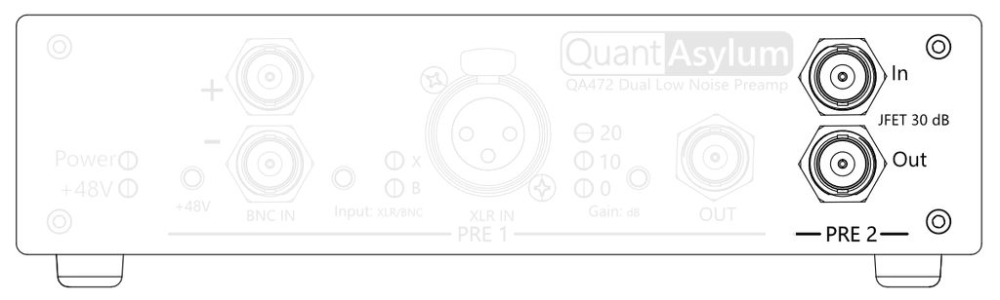

# Preamp 2 (JFET)

    
Preamp 2 is highlighted in the diagram above and includes a single BNC input and output with a fixed gain of 30 dB. It is intended to be used with higher impedance sources, is single-ended, and has lower noise than preamp 1.

It is based on the [JFE150](https://www.ti.com/product/JFE150) an ultra-low-noise N-channel JFET specifically designed for audio amplification, with a 1 MOhm input impedance and remarkably low voltage noise of $0.8 \text{nV}/\sqrt{\text{Hz}}$ at 1 kHz.

## BNC Input

!!! warning
    Inputs have minimum and maximum limits to the DC voltage (with respect to the BNC shield) of -1V and +50V and a maximum safe current limit of less than 20mA. Ensure that the voltages and currents drawn are within these limits. See the datasheet for more information.

Preamp 2 accepts signals on the "In" BNC terminal, which has an input impedance of 1 MOhm.

## BNC Output

Amplified signals are returned on the "Out" BNC terminal, which has an output impedance of 100 Ohms.

## Noise performance

The ultra-low noise performance of Preamp 2 is shown below; for more information, see the datasheet.

| Gain   |        RTO |        RTI |     RTI AW |
|--------|-----------:|-----------:|-----------:|
| 30 dB  | -102.0 dBV | -132.0 dBV | -134.2 dBV |
